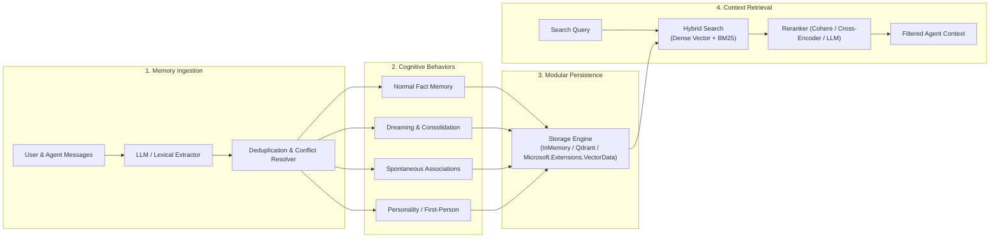

<div align="center">
  
</div>

# Mem0Sharp

[](https://www.nuget.org/packages/Mem0Sharp)
[](https://www.nuget.org/packages/Mem0Sharp)
[](https://github.com/jihadkhawaja/mem0sharp/releases)
[](https://dotnet.microsoft.com/)
[](LICENSE)

**Long-term cognitive memory engine for AI applications and agents in .NET.**

Mem0Sharp is an independent, standalone C#/.NET implementation of the open-source [Mem0 project](https://github.com/mem0ai/mem0). It delivers a unified service API for saving, searching, updating, and consolidating semantic memories with modular embedding and vector storage providers.

- 🔒 **100% Standalone & Local-First**: Runs entirely in-process in .NET with zero telemetry or third-party cloud service requirements.
- 🪶 **Broad Runtime Support**: Targets .NET Standard 2.0, .NET 8, .NET 9, and .NET 10 with built-in in-memory, Qdrant, and universal `Microsoft.Extensions.VectorData` persistence in a single package.
- 🧠 **Cognitive Memory Behaviors**: Goes beyond raw vector storage with autonomous behaviors (dreaming/consolidation, spontaneous associations, and personality-shaped first-person recall).
- 📍 **Spatial & Robotics Memory**: Stores timestamped 3D observations, reconstructs object beliefs from sensor evidence, and recalls measured action outcomes.
- 🔌 **Native Model Context Protocol (MCP)**: Includes 9 local MCP tools out of the box for agentic developer tools (Cursor, Claude Desktop, Copilot).

*Mem0Sharp is not affiliated with, sponsored by, or endorsed by Mem0 or mem0ai.*

---

## Quickstart

Get started immediately with in-memory storage, deterministic local embeddings, and no external services:

```csharp
using Mem0Sharp;

var memory = new MemoryService();
await memory.AddAsync("I prefer C# over Python.", new MemoryAddOptions { UserId = "alice" });
var results = await memory.SearchAsync(
    "What language does Alice like?",
    new MemorySearchOptions { Filter = new MemoryFilter(UserId: "alice"), TopK = 1 });

Console.WriteLine(results[0].Memory.Text); // I prefer C# over Python.
```

---

## Why Mem0Sharp? (Comparison Matrix)

| Feature / Capability | **Mem0Sharp** | Python Mem0 (OSS) | Hosted Mem0 SaaS | Raw Vector DBs | Ephemeral Chat Buffers |
| :--- | :---: | :---: | :---: | :---: | :---: |
| **Ecosystem & Runtime** | **.NET Standard 2.0 / .NET 8-10** | Python | Cloud API | Any Driver | Any Framework |
| **Local-First & Offline** | **100% (No Telemetry)** | 100% | ❌ Cloud Only | 100% | 100% |
| **Local In-Process Core** | **Yes** | ❌ Multi-package | ❌ Client SDK | ❌ Heavy client | Yes |
| **Cognitive Behaviors** *(Dreaming, Identity)* | **Built-in** | ❌ (Static) | ❌ (Static) | ❌ (Raw vectors) | ❌ |
| **Model Context Protocol (MCP)** | **9 Built-in Tools** | Separate repo | ❌ Cloud only | ❌ | ❌ |
| **Hybrid Search + Cross-Encoder Reranking** | **Built-in (BM25 + Dense)** | Basic | Proprietary | ❌ Manual setup | ❌ |
| **Audit History & Temporal Tracking** | **Built-in for supported stores** | Basic | Proprietary | ❌ Manual setup | ❌ |

---

## Architecture & Memory Lifecycle



---

## Installation

Install the package via NuGet:

```powershell
dotnet add package Mem0Sharp
```

---

## Features

- **Semantic & Hybrid Retrieval**: Dense vector search combined with BM25 keyword scoring and LLM/Cohere/Cross-Encoder reranking.
- **Multimodal & Image Memory**: Native support for image ingestion via Vision LLMs (OpenAI GPT-4.1 / GPT-4o, Anthropic Claude Sonnet 4, Google Gemini 2.5, and Ollama Qwen2.5-VL / Llama 3.2 Vision) and direct image embedding search (`IImageEmbeddingGenerator`).
- **Model Support**: Built-in support for OpenAI-compatible, Anthropic, and Ollama model APIs.
- **Cognitive Behaviors**:
  - `Normal`: Standard factual extraction and recall.
  - `Dreaming`: Background memory consolidation, compressing repeated facts into long-term insights.
  - `Random Thoughts`: Spontaneous associations and creative prompt injections.
  - `Personal/Identity`: First-person perspective memory shaping.
- **Audit, Temporal Reads & Recovery**: Track `ADD`, `UPDATE`, and `DELETE` events, query historical state without mutation, and perform filtered rollback with history-capable stores. See [Providers & Persistence](docs/providers-and-persistence.md#5-point-in-time-reads-and-rollback) for provider limitations.
- **3D Spatial & Robotics Memory**: Save map-scoped observations, reconstruct event-time object beliefs with uncertainty and visibility states, derive conservative metric relations, and recall controller-reported action episodes.
- **Scoped Organization**: User, session, and agent-level memory partitioning with run filters and metadata matching.
- **Model Context Protocol (MCP)**: 9 built-in tools ready to plug into Claude Desktop, Cursor, and VS Code.
- **Batch Operations**: High-throughput transactional batch embeddings and searches.

---

## Usage Examples

### 1. Basic In-Memory Operations

```csharp
using Mem0Sharp;

var memory = new MemoryService();

// Add a memory
await memory.AddAsync("I prefer dark mode and vim keybindings", userId: "alice");

// Search memories
var results = await memory.SearchAsync(
    "What editor settings does Alice prefer?",
    new MemoryFilter(UserId: "alice"),
    topK: 3);

foreach (var result in results)
{
    Console.WriteLine($"{result.Score:F3}: {result.Memory.Text}");
}

// Update and History
var allMemories = await memory.GetAllAsync(new MemoryFilter(UserId: "alice"));
var memoryId = allMemories[0].Id;
await memory.UpdateAsync(memoryId, "I prefer dark mode and Neovim keybindings");
var history = await memory.GetHistoryAsync(memoryId);
```

### 2. Multi-turn & Multimodal Conversation Extraction

```csharp
// Extract facts from messages including images
await memory.AddAsync(
[
    new Message("user", "Here is my conference receipt."),
    Message.FromImage(receiptBytes, "image/png"),
    new Message("assistant", "I've reviewed the receipt.")
],
userId: "alice",
scope: MemoryScope.User);
```

### 3. Microsoft.Extensions.VectorData (MEVD) Store

```csharp
using Mem0Sharp;
using Microsoft.Extensions.VectorData;

// Use any MEVD-compatible vector store (Azure AI Search, PostgreSQL/pgvector, SQLite, Redis, Qdrant, Milvus, Pinecone, etc.)
VectorStore vectorStore = GetVectorStore();
var store = new VectorDataMemoryStore(vectorStore, new VectorDataMemoryStoreOptions
{
    CollectionName = "user_memories",
    VectorDimensions = 384,
    AutoCreateCollection = true
});
await store.InitializeAsync();

var memory = new MemoryService(store: store);
```

---

## Ecosystem Integration & Samples

Explore practical runnable examples in the [`samples/`](samples/) folder:

- **[Getting Started](samples/GettingStarted/README.md)**: Zero-setup CRUD, search, and history tracking.
- **[SQLite Vector Store](samples/VectorDataSqlite/README.md)**: Local embedded persistence with `Microsoft.Extensions.VectorData` and `sqlite-vec`.
- **[PostgreSQL pgvector](samples/VectorDataPostgres/README.md)**: Enterprise persistent vector storage with `Microsoft.Extensions.VectorData` and `pgvector`.
- **[Memory Behaviors](samples/MemoryBehaviors/README.md)**: Fact extraction, dreaming/consolidation, spontaneous associations, and personality-shaped memory.
- **[3D Spatial Memory Robot](samples/3DSpatialMemoryGodot/README.md)**: A Godot warehouse robot that remembers camera observations and recalls nearby objects from PostgreSQL/pgvector.
- **[Ollama Integration](samples/Ollama/README.md)**: Fully offline local LLM extraction and embeddings.
- **[Agent Framework Memory](samples/AgentFrameworkMemory/README.md)**: Cross-session persistent memory with `Microsoft.Extensions.VectorData` for Microsoft Agent Framework.
- **[MCP Server](samples/McpServer/README.md)**: Standalone Model Context Protocol server exposing Mem0Sharp tools to Claude Desktop & Cursor.

---

## Documentation

- **Guides**: [Documentation Home](docs/README.md) | [Getting Started](docs/getting-started.md) | [Providers & Persistence](docs/providers-and-persistence.md)
- **Reference**: [API Reference](docs/api-reference.md) | [Mem0 Python Parity Guide](docs/mem0-python-parity.md)
- **Benchmarking**: [Evaluation Harness & Metrics](docs/evaluation.md)
- **Architecture**: [Architecture Overview](docs/architecture.md) | [Contribution Guidelines](CONTRIBUTING.md)

---

## Build & Test

```powershell
dotnet build .\Mem0Sharp.slnx
dotnet test .\tests\Mem0Sharp.Tests\Mem0Sharp.Tests.csproj
```

---

## Attribution and Trademarks

Mem0Sharp is an independent .NET implementation inspired by the open-source [Mem0 project](https://github.com/mem0ai/mem0). The original Mem0 project is copyright 2023 Taranjeet Singh and is licensed under the Apache License 2.0. Copyright for the Mem0Sharp implementation and its modifications is held by Jihad Khawaja and contributors. See [NOTICE](NOTICE) and [LICENSE](LICENSE) for details.

Mem0 and related marks belong to their respective owners. Mem0Sharp is not affiliated with, sponsored by, or endorsed by Mem0 or mem0ai.

