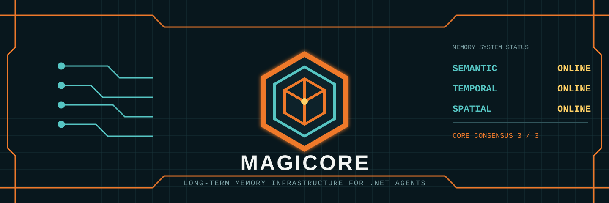
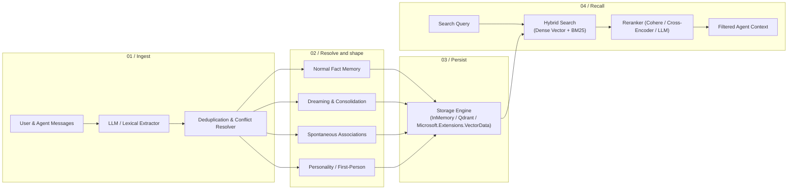

<div align="center">
    
</div>

<h1 align="center">MagiCore</h1>

<p align="center"><strong>Long-term memory infrastructure for AI applications and agents in .NET.</strong></p>

<p align="center">
    Store what happened. Recover what mattered. Recall it in the right context.
</p>

<div align="center">

[](https://www.nuget.org/packages/MagiCore)
[](https://www.nuget.org/packages/MagiCore)
[](https://github.com/jihadkhawaja/magicore/releases)
[](https://dotnet.microsoft.com/)
[](LICENSE)

</div>

MagiCore is a local-first C# library for building memory into agents, assistants, simulations, and robots. It combines semantic retrieval with auditable history, event-time recall, cognitive consolidation, and provider-neutral persistence.

| Memory plane | What it gives your application |
| --- | --- |
| **Semantic** | Dense and hybrid retrieval, reranking, entities, relations, and multimodal memories. |
| **Temporal** | Audit history, point-in-time reads, rollback, and event-time filtering. |
| **Spatial** | Timestamped 3D observations, reconstructed object beliefs, and measured action episodes. |

Everything runs in-process by default with no telemetry and no required hosted service. Production integrations use standard `Microsoft.Extensions.AI` and `Microsoft.Extensions.VectorData` abstractions, so model and storage choices stay at the application boundary.

---

## Start the core

Install the package:

```powershell
dotnet add package MagiCore
```

Then create a zero-configuration memory service. The default store, extractor, and lexical embedding generator are deterministic and local:

```csharp
using MagiCore;

var memory = new MemoryService();
await memory.AddAsync("I prefer C# over Python.", new MemoryAddOptions { UserId = "alice" });
var results = await memory.SearchAsync(
    "What language does Alice like?",
    new MemorySearchOptions { Filter = new MemoryFilter(UserId: "alice"), TopK = 1 });

Console.WriteLine(results[0].Memory.Text);
```

## How memory moves



## System capabilities

- **Semantic & Hybrid Retrieval**: Dense vector search combined with BM25 keyword scoring and LLM/Cohere/Cross-Encoder reranking.
- **Multimodal & Image Memory**: Ingest image content through `Microsoft.Extensions.AI` and search direct image embeddings with `IImageEmbeddingGenerator`.
- **Model Integration**: Bring any compatible `IChatClient` and `IEmbeddingGenerator`; examples cover OpenAI, Ollama, and local ONNX workflows.
- **Cognitive Behaviors**:
  - `Normal`: Standard factual extraction and recall.
  - `Dreaming`: Background memory consolidation, compressing repeated facts into long-term insights.
  - `Random Thoughts`: Spontaneous associations and creative prompt injections.
  - `Personal/Identity`: First-person perspective memory shaping.
- **Audit, Temporal Reads & Recovery**: Track `ADD`, `UPDATE`, and `DELETE` events, query historical state without mutation, and perform filtered rollback with history-capable stores. See [Providers & Persistence](docs/providers-and-persistence.md#5-point-in-time-reads-and-rollback) for provider limitations.
- **3D Spatial & Robotics Memory**: Save map-scoped observations, reconstruct event-time object beliefs with uncertainty and visibility states, derive conservative metric relations, and recall controller-reported action episodes.
- **Scoped Organization**: User, session, and agent-level memory partitioning with run filters and metadata matching.
- **Model Context Protocol (MCP)**: A runnable sample server exposes nine local memory tools through the official .NET MCP SDK.
- **Batch Operations**: High-throughput transactional batch embeddings and searches.

---

## Build from local to durable

### Local memory lifecycle

```csharp
using MagiCore;

var memory = new MemoryService();

// Add a memory
await memory.AddAsync("I prefer dark mode and vim keybindings", userId: "alice");

// Search memories
var results = await memory.SearchAsync(
    "What editor settings does Alice prefer?",
    new MemoryFilter(UserId: "alice"),
    topK: 3);

foreach (var result in results)
{
    Console.WriteLine($"{result.Score:F3}: {result.Memory.Text}");
}

// Update and History
var allMemories = await memory.GetAllAsync(new MemoryFilter(UserId: "alice"));
var memoryId = allMemories[0].Id;
await memory.UpdateAsync(memoryId, "I prefer dark mode and Neovim keybindings");
var history = await memory.GetHistoryAsync(memoryId);
```

### Multi-turn and multimodal extraction

```csharp
// Extract facts from messages including images
await memory.AddAsync(
[
    new Message("user", "Here is my conference receipt."),
    Message.FromImage(receiptBytes, "image/png"),
    new Message("assistant", "I've reviewed the receipt.")
],
userId: "alice",
scope: MemoryScope.User);
```

### Durable vector storage

```csharp
using MagiCore;
using Microsoft.Extensions.VectorData;

// Use any MEVD-compatible vector store (Azure AI Search, PostgreSQL/pgvector, SQLite, Redis, Qdrant, Milvus, Pinecone, etc.)
VectorStore vectorStore = GetVectorStore();
var store = new VectorDataMemoryStore(vectorStore, new VectorDataMemoryStoreOptions
{
    CollectionName = "user_memories",
    VectorDimensions = 384,
    AutoCreateCollection = true
});
await store.InitializeAsync();

var memory = new MemoryService(store: store);
```

---

## Choose a working sample

Each sample is runnable and focused on one deployment path. Start with [Getting Started](samples/GettingStarted/README.md), then select the infrastructure your application needs.

- **[Getting Started](samples/GettingStarted/README.md)**: Zero-setup CRUD, search, and history tracking.
- **[SQLite Vector Store](samples/VectorDataSqlite/README.md)**: Local embedded persistence with `Microsoft.Extensions.VectorData` and `sqlite-vec`.
- **[PostgreSQL pgvector](samples/VectorDataPostgres/README.md)**: Enterprise persistent vector storage with `Microsoft.Extensions.VectorData` and `pgvector`.
- **[Memory Behaviors](samples/MemoryBehaviors/README.md)**: Fact extraction, dreaming/consolidation, spontaneous associations, and personality-shaped memory.
- **[3D Spatial Memory Robot](samples/3DSpatialMemoryGodot/README.md)**: A Godot warehouse robot that remembers camera observations and recalls nearby objects from PostgreSQL/pgvector.
- **[Ollama Integration](samples/Ollama/README.md)**: Fully offline local LLM extraction and embeddings.
- **[Agent Framework Memory](samples/AgentFrameworkMemory/README.md)**: Cross-session persistent memory with `Microsoft.Extensions.VectorData` for Microsoft Agent Framework.
- **[MCP Server](samples/McpServer/README.md)**: Standalone Model Context Protocol host for Claude Desktop, Cursor, and other MCP clients.

---

## Operator manual

- **Guides**: [Documentation Home](docs/README.md) | [Getting Started](docs/getting-started.md) | [Providers & Persistence](docs/providers-and-persistence.md)
- **Reference**: [API Reference](docs/api-reference.md)
- **Benchmarking**: [Evaluation Harness & Metrics](docs/evaluation.md)
- **Architecture**: [Architecture Overview](docs/architecture.md) | [Contribution Guidelines](CONTRIBUTING.md)

---

## Verify the system

```powershell
dotnet build .\MagiCore.slnx
dotnet test .\tests\MagiCore.Tests\MagiCore.Tests.csproj
```

---

## License

MagiCore is licensed under the [Apache License 2.0](LICENSE).

