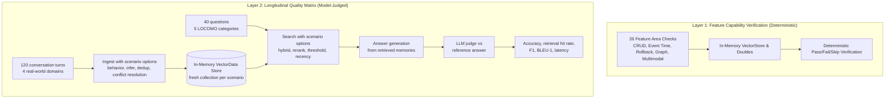

# Evaluation

MagiCore ships with a comprehensive evaluation suite in [evaluation/](../evaluation/README.md) that measures both deterministic API feature capabilities and memory-quality performance across realistic multi-session workloads.

The suite evaluates memory across two complementary layers:
1. **Feature Capability Verification**: 26 comprehensive checks exercising core CRUD, conversation ingestion, batching, deduplication, identity scopes, compound metadata expressions, paging, expiration, event-time retrieval, point-in-time reads, rollback, consolidation verification, memory behavior policies, conflict decisions, procedural memory, entity linking, graph memory lifecycle, admission gates, deferred trajectory extraction, multimodal image memory, and reset semantics.
2. **Longitudinal Memory Benchmark**: An ingest → search → answer → judge quality pipeline following the LOCOMO benchmark methodology over a self-contained real-world corpus.

## Method



The benchmark corpus ([`evaldataset.realworld.json`](../evaluation/MagiCore.Evaluation/evaldataset.realworld.json)) spans 4 realistic domains across 20 dated sessions (120 conversation turns) and evaluates 40 questions across 5 categories:

| Category | Questions | What it tests |
| --- | ---: | --- |
| Single-hop | 12 | Recalling one stated fact among realistic distractors |
| Multi-hop | 8 | Combining evidence distributed across multiple sessions |
| Temporal | 8 | Reconstructing changes to plans, ownership, and preferences over time |
| Contradiction | 4 | Preferring corrected/current facts over stale or similar facts |
| Adversarial | 8 | Declining requests for absent, sensitive, or unstated details |

**Accuracy (J-score)** is the share of answers judged CORRECT by an LLM judge against a reference answer, using the LOCOMO benchmark's unified judge rules: JSON verdicts with reasoning, partial credit for list answers, paraphrase and date tolerance (±14 days, durations within 50%), and semantic-overlap matching. Adversarial questions score CORRECT only when the system declines to guess. Alongside the judge score, the harness reports token-level **Mean F1** and **BLEU-1** between the generated and reference answers. **Retrieval hit rate** is the share of answerable questions where expected evidence appears in the retrieved memories. **Mean retrieved** is the average number of candidates returned per question; evaluate it together with hit rate to distinguish useful filtering from lost recall.

## Scenario matrix

| Scenario | What it varies |
| --- | --- |
| `baseline` | Default pipeline: LLM extraction, hybrid search, dedup on |
| `realistic-long-haul` | Long-horizon retrieval tuned for recency-aware personal memory and preference drift |
| `stale-forget` | Retention pruning to simulate forgetting stale or superseded facts |
| `no-hybrid` | Semantic vector search only (hybrid keyword fusion disabled) |
| `llm-rerank` | Adds `LlmReranker` over retrieved candidates |
| `conflict-resolution` | Adds `LlmMemoryConflictResolver` (ADD/UPDATE/DELETE/NONE decisions) |
| `no-dedup` | Deduplication off |
| `infer-off` | Raw message storage (Infer = false), no LLM extraction |
| `strict-threshold` | Search threshold raised to 0.3 |
| `event-time` | Opt-in session-dated ingestion and confidence-gated date/year filtering on the dedicated temporal dataset |
| `behavior-dreaming` | Dreaming memory behavior (thematic consolidation) |
| `behavior-random-thoughts` | Random-thoughts memory behavior (associated thoughts) |
| `behavior-personal-memory` | Persona-shaped first-person memory behavior |

## Results

### Latest live scenario matrix (2026-09-02 15:07 UTC)

Authoritative full run with `gpt-5.6-luna` for extraction, answering, and judging, and `text-embedding-3-small` for embeddings via `Microsoft.Extensions.AI` against the `VectorDataMemoryStore` backend.

Raw detailed reports: [Markdown](../evaluation/results/evaluation-20260902-150733.md) and [JSON](../evaluation/results/evaluation-20260902-150733.json).  
Interactive visualizer: [MagiCore Graph Memory Visualizer](../evaluation/visualizer/index.html).

#### Feature capability evaluation

**22 passed, 0 failed, 4 skipped** (provider-specific hosted adapters skipped with documented reasons).

#### Scenario summary

| Scenario | Accuracy (J) | Mean F1 | Mean BLEU-1 | Retrieval hit rate | Memories | Mean search (ms) | Ingest (s) |
| --- | --- | --- | --- | --- | --- | --- | --- |
| baseline | 88% (35/40; 95% CI 74%-95%) | 0.42 | 0.30 | 81% (26/32; 95% CI 65%-91%) | 97 | 213 | 60.2 |
| realistic-long-haul | 88% (35/40; 95% CI 74%-95%) | 0.39 | 0.29 | 81% (26/32; 95% CI 65%-91%) | 100 | 208 | 76.6 |
| stale-forget | 82% (33/40; 95% CI 68%-91%) | 0.37 | 0.28 | 84% (27/32; 95% CI 68%-93%) | 97 | 253 | 57.0 |
| no-hybrid | 90% (36/40; 95% CI 77%-96%) | 0.38 | 0.26 | 91% (29/32; 95% CI 76%-97%) | 102 | 228 | 59.8 |
| llm-rerank | 93% (37/40; 95% CI 80%-97%) | 0.41 | 0.29 | 88% (28/32; 95% CI 72%-95%) | 101 | 6131 | 55.1 |
| conflict-resolution | 100% (40/40; 95% CI 91%-100%) | 0.44 | 0.31 | 97% (31/32; 95% CI 84%-99%) | 74 | 263 | 109.9 |
| no-dedup | 85% (34/40; 95% CI 71%-93%) | 0.38 | 0.28 | 81% (26/32; 95% CI 65%-91%) | 102 | 223 | 57.5 |
| infer-off | 97% (39/40; 95% CI 87%-100%) | 0.46 | 0.36 | 94% (30/32; 95% CI 80%-98%) | 120 | 216 | 13.2 |
| strict-threshold | 55% (22/40; 95% CI 40%-69%) | 0.24 | 0.16 | 47% (15/32; 95% CI 31%-64%) | 113 | 209 | 58.6 |
| behavior-dreaming | 93% (37/40; 95% CI 80%-97%) | 0.43 | 0.32 | 84% (27/32; 95% CI 68%-93%) | 91 | 230 | 62.4 |
| behavior-random-thoughts | 93% (37/40; 95% CI 80%-97%) | 0.42 | 0.30 | 88% (28/32; 95% CI 72%-95%) | 91 | 223 | 62.9 |
| behavior-personal-memory | 97% (39/40; 95% CI 87%-100%) | 0.45 | 0.34 | 94% (30/32; 95% CI 80%-98%) | 76 | 297 | 56.8 |

### Accuracy by category

| Scenario | Single-hop | Multi-hop | Temporal | Contradiction | Adversarial |
| --- | ---: | ---: | ---: | ---: | ---: |
| baseline | 83% | 88% | 75% | 100% | 100% |
| realistic-long-haul | 83% | 100% | 62% | 100% | 100% |
| stale-forget | 83% | 100% | 38% | 100% | 100% |
| no-hybrid | 83% | 100% | 75% | 100% | 100% |
| llm-rerank | 92% | 100% | 75% | 100% | 100% |
| conflict-resolution | 100% | 100% | 100% | 100% | 100% |
| no-dedup | 83% | 100% | 50% | 100% | 100% |
| infer-off | 92% | 100% | 100% | 100% | 100% |
| strict-threshold | 50% | 25% | 38% | 75% | 100% |
| behavior-dreaming | 83% | 100% | 88% | 100% | 100% |
| behavior-random-thoughts | 92% | 100% | 75% | 100% | 100% |
| behavior-personal-memory | 92% | 100% | 100% | 100% | 100% |

### Harness validation (Self-test mode)

The deterministic self-test run validates the harness plumbing, 20 local capability checks, and retrieval hit rates across scenarios without requiring external API credentials:

| Scenario | Mode | Accuracy | Retrieval hit rate | Memories | Mean search (ms) |
| --- | --- | --- | --- | --- | --- |
| baseline | retrieval-only, deterministic local embeddings | n/a | 88% (28/32) | 120 | 2 |
| realistic-long-haul | retrieval-only, deterministic local embeddings | n/a | 88% (28/32) | 120 | 1 |
| stale-forget | retrieval-only, deterministic local embeddings | n/a | 88% (28/32) | 120 | 1 |
| no-hybrid | retrieval-only, deterministic local embeddings | n/a | 88% (28/32) | 120 | 1 |
| infer-off | retrieval-only, deterministic local embeddings | n/a | 88% (28/32) | 120 | 1 |
| strict-threshold | retrieval-only, deterministic local embeddings | n/a | 25% (8/32) | 120 | 1 |

### Event-time retrieval validation

Event-time retrieval has two evaluation layers:

- The deterministic capability check stores canonical reference timestamps and verifies that an interpreted 2025 query selects the 2025 fact.
- The opt-in `event-time` scenario compares baseline retrieval against session-dated ingestion and temporal filtering on [`evaldataset.temporal.json`](../evaluation/MagiCore.Evaluation/evaldataset.temporal.json), a cross-year Atlas workload with explicit year/date questions and a non-temporal control.

A live model-judged comparison on 2026-09-02 on `evaldataset.temporal.json` achieved 83% accuracy (5/6) for both `baseline` and `event-time`, while temporal filtering reduced mean retrieved candidates from 10.0 to 5.0. One exact-date query returned no candidates, so the result demonstrates lower retrieval volume but not uniformly preserved recall. The deterministic suite confirmed 22 capability checks passed with 0 failures.

## Key findings

- **Conflict Resolution Superiority**: `conflict-resolution` achieved **100% accuracy (40/40)** across all 5 benchmark categories with the most compact memory footprint (**74 memories** vs 97 in baseline) and highest retrieval hit rate (**97%**), cleanly handling fact contradictions and temporal updates at ingestion time.
- **Persona-Shaped & Behavioral Memory**: `behavior-personal-memory` reached **97% accuracy (39/40)** with 94% retrieval hit rate and compact 76-memory storage. `behavior-dreaming` and `behavior-random-thoughts` both achieved **93% accuracy (37/40)** with 100% multi-hop synthesis.
- **LLM Reranking**: `llm-rerank` improved accuracy to **93% (37/40)** and retrieval hit rate to **88%** (vs 81% in baseline), boosting single-hop (92%) and multi-hop (100%) precision.
- **Adversarial Precision**: Adversarial accuracy was **100% across all 12 scenarios**, demonstrating robust resistance to ungrounded hallucination and strict boundary enforcement on sensitive or unstated details.

## Reproducing and publishing results

To run the deterministic self-test suite (no credentials needed):

```powershell
dotnet run --project .\evaluation\MagiCore.Evaluation\MagiCore.Evaluation.csproj --configuration Release -- --self-test
```

To validate and compare event-time retrieval without credentials:

```powershell
dotnet run --project .\evaluation\MagiCore.Evaluation\MagiCore.Evaluation.csproj --configuration Release -- --dataset .\evaluation\MagiCore.Evaluation\evaldataset.temporal.json --validate-dataset
dotnet run --project .\evaluation\MagiCore.Evaluation\MagiCore.Evaluation.csproj --configuration Release -- --self-test --dataset .\evaluation\MagiCore.Evaluation\evaldataset.temporal.json --scenario baseline,event-time
```

The `event-time` scenario is excluded from the default matrix to keep published longitudinal comparisons stable. Request it explicitly with `--scenario event-time` or the baseline comparison above.

To run the full live model evaluation matrix:

```powershell
Copy-Item .\evaluation\MagiCore.Evaluation\evalconfig.example.yaml .\evaluation\MagiCore.Evaluation\evalconfig.local.yaml
# Add your API key to evalconfig.local.yaml, then:
dotnet run --project .\evaluation\MagiCore.Evaluation\MagiCore.Evaluation.csproj --configuration Release
```

To evaluate a custom dataset JSON:

```powershell
dotnet run --project .\evaluation\MagiCore.Evaluation\MagiCore.Evaluation.csproj --configuration Release -- --dataset .\path\to\dataset.json
```

The run writes Markdown and JSON reports to `results/`.

