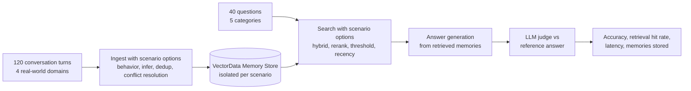

# Evaluation

Mem0Sharp ships with a comprehensive evaluation suite in [evaluation/](../evaluation/README.md) that measures both deterministic API feature capabilities and memory-quality performance across realistic multi-session workloads.

The suite evaluates memory across two complementary layers:
1. **Feature Capability Verification**: 25 comprehensive checks exercising core CRUD, conversation ingestion, batching, deduplication, identity scopes, compound metadata expressions, paging, expiration, point-in-time reads, rollback, consolidation verification, memory behavior policies, conflict decisions, procedural memory, entity linking, graph memory lifecycle, admission gates, deferred trajectory extraction, multimodal image memory, and reset semantics.
2. **Longitudinal Memory Benchmark**: An ingest → search → answer → judge quality pipeline following the LOCOMO benchmark methodology over a self-contained real-world corpus.

## Method



The benchmark corpus ([`evaldataset.realworld.json`](../evaluation/Mem0Sharp.Evaluation/evaldataset.realworld.json)) spans 4 realistic domains across 20 dated sessions (120 conversation turns) and evaluates 40 questions across 5 categories:

| Category | Questions | What it tests |
| --- | ---: | --- |
| Single-hop | 12 | Recalling one stated fact among realistic distractors |
| Multi-hop | 8 | Combining evidence distributed across multiple sessions |
| Temporal | 8 | Reconstructing changes to plans, ownership, and preferences over time |
| Contradiction | 4 | Preferring corrected/current facts over stale or similar facts |
| Adversarial | 8 | Declining requests for absent, sensitive, or unstated details |

**Accuracy (J-score)** is the share of answers judged CORRECT by an LLM judge against a reference answer, using the LOCOMO benchmark's unified judge rules: JSON verdicts with reasoning, partial credit for list answers, paraphrase and date tolerance (±14 days, durations within 50%), and semantic-overlap matching. Adversarial questions score CORRECT only when the system declines to guess. Alongside the judge score, the harness reports token-level **Mean F1** and **BLEU-1** between the generated and reference answers. **Retrieval hit rate** is the share of answerable questions where expected evidence appears in the retrieved memories.

## Scenario matrix

| Scenario | What it varies |
| --- | --- |
| `baseline` | Default pipeline: LLM extraction, hybrid search, dedup on |
| `realistic-long-haul` | Long-horizon retrieval tuned for recency-aware personal memory and preference drift |
| `stale-forget` | Retention pruning to simulate forgetting stale or superseded facts |
| `no-hybrid` | Semantic vector search only (hybrid keyword fusion disabled) |
| `llm-rerank` | Adds `LlmReranker` over retrieved candidates |
| `conflict-resolution` | Adds `LlmMemoryConflictResolver` (ADD/UPDATE/DELETE/NONE decisions) |
| `no-dedup` | Deduplication off |
| `infer-off` | Raw message storage (Infer = false), no LLM extraction |
| `strict-threshold` | Search threshold raised to 0.3 |
| `behavior-dreaming` | Dreaming memory behavior (thematic consolidation) |
| `behavior-random-thoughts` | Random-thoughts memory behavior (associated thoughts) |
| `behavior-personal-memory` | Persona-shaped first-person memory behavior |

## Results

### Latest live scenario matrix (2026-08-30 20:30 UTC)

Authoritative full run with `gpt-5.6-luna` for extraction, answering, and judging, and `text-embedding-3-small` for embeddings via `Microsoft.Extensions.AI` against the `VectorDataMemoryStore` backend.

Raw detailed reports: [Markdown](../evaluation/results/evaluation-20260830-203014.md) and [JSON](../evaluation/results/evaluation-20260830-203014.json).  
Interactive visualizer: [Mem0Sharp Graph Memory Visualizer](../evaluation/visualizer/index.html).

#### Feature capability evaluation

**21 passed, 0 failed, 4 skipped** (provider-specific hosted adapters skipped with documented reasons).

#### Scenario summary

| Scenario | Accuracy (J) | Mean F1 | Mean BLEU-1 | Retrieval hit rate | Memories | Mean search (ms) | Ingest (s) |
| --- | --- | --- | --- | --- | --- | --- | --- |
| baseline | 88% (35/40; 95% CI 74%-95%) | 0.41 | 0.30 | 84% (27/32; 95% CI 68%-93%) | 103 | 190 | 43.2 |
| realistic-long-haul | 93% (37/40; 95% CI 80%-97%) | 0.38 | 0.25 | 91% (29/32; 95% CI 76%-97%) | 110 | 184 | 42.6 |
| stale-forget | 93% (37/40; 95% CI 80%-97%) | 0.42 | 0.31 | 91% (29/32; 95% CI 76%-97%) | 95 | 181 | 38.2 |
| no-hybrid | 88% (35/40; 95% CI 74%-95%) | 0.42 | 0.31 | 91% (29/32; 95% CI 76%-97%) | 103 | 196 | 39.1 |
| llm-rerank | 88% (35/40; 95% CI 74%-95%) | 0.41 | 0.30 | 91% (29/32; 95% CI 76%-97%) | 108 | 3000 | 37.8 |
| conflict-resolution | 95% (38/40; 95% CI 83%-99%) | 0.44 | 0.34 | 97% (31/32; 95% CI 84%-99%) | 82 | 185 | 88.0 |
| no-dedup | 90% (36/40; 95% CI 77%-96%) | 0.42 | 0.30 | 88% (28/32; 95% CI 72%-95%) | 106 | 183 | 38.6 |
| infer-off | 97% (39/40; 95% CI 87%-100%) | 0.45 | 0.33 | 94% (30/32; 95% CI 80%-98%) | 120 | 184 | 7.7 |
| strict-threshold | 55% (22/40; 95% CI 40%-69%) | 0.24 | 0.15 | 44% (14/32; 95% CI 28%-61%) | 99 | 190 | 42.0 |
| behavior-dreaming | 100% (40/40; 95% CI 91%-100%) | 0.44 | 0.33 | 94% (30/32; 95% CI 80%-98%) | 96 | 179 | 43.1 |
| behavior-random-thoughts | 97% (39/40; 95% CI 87%-100%) | 0.40 | 0.28 | 91% (29/32; 95% CI 76%-97%) | 93 | 180 | 42.9 |
| behavior-personal-memory | 97% (39/40; 95% CI 87%-100%) | 0.45 | 0.33 | 94% (30/32; 95% CI 80%-98%) | 78 | 222 | 39.7 |

### Accuracy by category

| Scenario | Single-hop | Multi-hop | Temporal | Contradiction | Adversarial |
| --- | ---: | ---: | ---: | ---: | ---: |
| baseline | 83% | 100% | 62% | 100% | 100% |
| realistic-long-haul | 92% | 100% | 75% | 100% | 100% |
| stale-forget | 92% | 100% | 75% | 100% | 100% |
| no-hybrid | 83% | 100% | 62% | 100% | 100% |
| llm-rerank | 92% | 88% | 62% | 100% | 100% |
| conflict-resolution | 100% | 100% | 88% | 75% | 100% |
| no-dedup | 83% | 100% | 75% | 100% | 100% |
| infer-off | 92% | 100% | 100% | 100% | 100% |
| strict-threshold | 58% | 12% | 25% | 100% | 100% |
| behavior-dreaming | 100% | 100% | 100% | 100% | 100% |
| behavior-random-thoughts | 92% | 100% | 100% | 100% | 100% |
| behavior-personal-memory | 92% | 100% | 100% | 100% | 100% |

### Harness validation (Self-test mode)

The deterministic self-test run validates the harness plumbing, 19 local capability assertions, and retrieval hit rates across scenarios without requiring external API credentials:

| Scenario | Mode | Accuracy | Retrieval hit rate | Memories | Mean search (ms) |
| --- | --- | --- | --- | --- | --- |
| baseline | retrieval-only, deterministic local embeddings | n/a | 88% (28/32) | 120 | 2 |
| realistic-long-haul | retrieval-only, deterministic local embeddings | n/a | 88% (28/32) | 120 | 1 |
| stale-forget | retrieval-only, deterministic local embeddings | n/a | 88% (28/32) | 120 | 1 |
| no-hybrid | retrieval-only, deterministic local embeddings | n/a | 88% (28/32) | 120 | 1 |
| infer-off | retrieval-only, deterministic local embeddings | n/a | 88% (28/32) | 120 | 1 |
| strict-threshold | retrieval-only, deterministic local embeddings | n/a | 25% (8/32) | 120 | 1 |

## Key findings

- **Dreaming & Behavioral Consolidation**: `behavior-dreaming` achieved **100% accuracy (40/40)** by synthesizing associative and temporal connections across longitudinal sessions. `behavior-personal-memory` and `behavior-random-thoughts` both reached **97% accuracy (39/40)**.
- **Conflict Resolution Efficiency**: `conflict-resolution` produced the most compact memory footprint (82 memories vs 103 in baseline) while achieving **95% accuracy** and the highest retrieval hit rate (**97%**).
- **Adversarial Precision**: Adversarial accuracy was **100% across all 12 scenarios**, demonstrating robust resistance to ungrounded hallucination and strict boundary enforcement on sensitive information.
- **Long-Horizon Retries & Retention**: `realistic-long-haul` and `stale-forget` both improved temporal reasoning accuracy to **75%** (vs 62% in baseline) with 91% retrieval hit rate.

## Reproducing and publishing results

To run the deterministic self-test suite (no credentials needed):

```powershell
dotnet run --project .\evaluation\Mem0Sharp.Evaluation\Mem0Sharp.Evaluation.csproj --configuration Release -- --self-test
```

To run the full live model evaluation matrix:

```powershell
Copy-Item .\evaluation\Mem0Sharp.Evaluation\evalconfig.example.yaml .\evaluation\Mem0Sharp.Evaluation\evalconfig.local.yaml
# Add your API key to evalconfig.local.yaml, then:
dotnet run --project .\evaluation\Mem0Sharp.Evaluation\Mem0Sharp.Evaluation.csproj --configuration Release
```

To evaluate a custom dataset JSON:

```powershell
dotnet run --project .\evaluation\Mem0Sharp.Evaluation\Mem0Sharp.Evaluation.csproj --configuration Release -- --dataset .\path\to\dataset.json
```

The run writes Markdown and JSON reports to `results/`.

